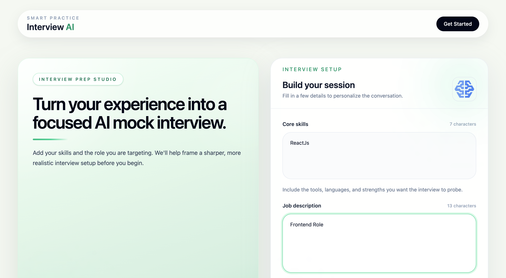
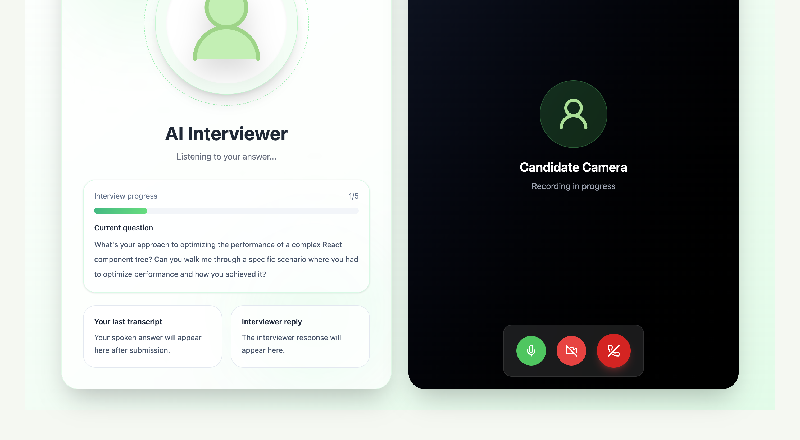
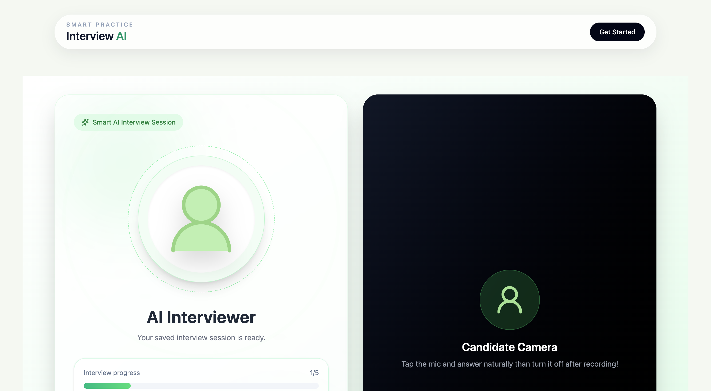
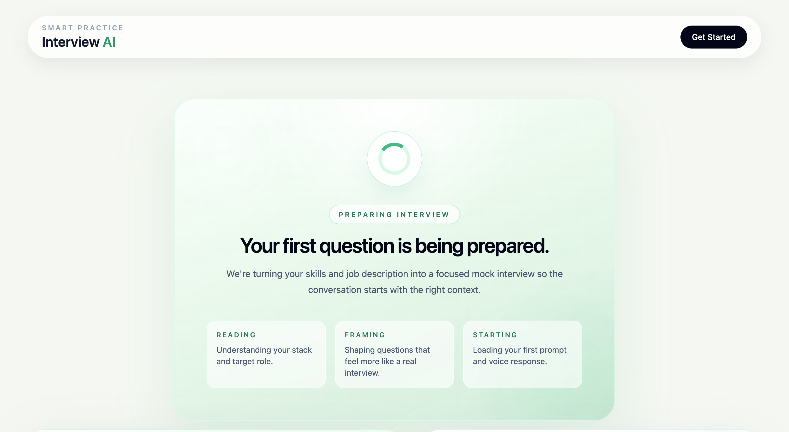
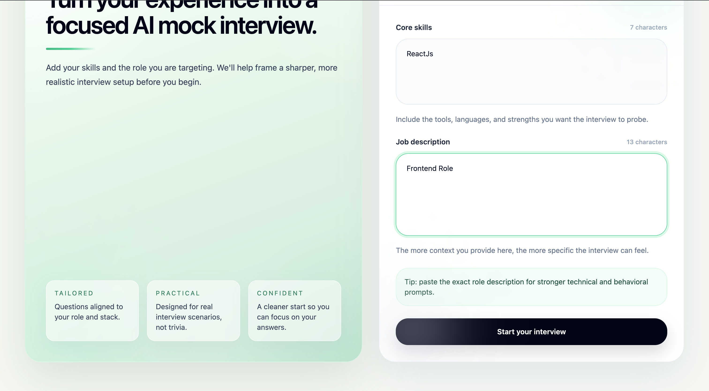

# AI Interview

<p align="center">
  <strong>An open source AI-powered mock interview platform for realistic voice-based practice.</strong>
</p>

<p align="center">
  Generate tailored interview questions, answer them out loud, get transcript-based evaluation, and receive actionable feedback with a final performance summary.
</p>

<p align="center">
  
  
  
  
  
</p>

## Overview

AI Interview helps candidates simulate job interviews in a more practical way than static question lists. Instead of only reading prompts, users can speak their answers, get response-aware follow-ups, receive per-answer scoring, and finish with a concise performance summary.

This project is built for learners, job seekers, and contributors who want to explore voice interfaces, local AI tooling, interview coaching workflows, and full-stack product development.

## Why this project

- Personalized mock interviews based on your skills and target role
- Voice-first practice instead of text-only rehearsal
- AI-generated follow-ups and answer evaluation
- Session persistence so users can continue later
- Open source codebase that is easy to extend and improve

## Key features

- Tailored question generation from skills, resume context, or job description
- Spoken-answer capture through the browser microphone
- Audio transcription using `whisper.cpp`
- AI-powered decisioning for follow-ups and answer scoring using Ollama
- Text-to-speech playback for interviewer prompts and responses
- Final interview summary with overall score and improvement direction

## Screenshots

<p align="center">
  
</p>

<p align="center">
  
</p>

<p align="center">
  
</p>

<p align="center">
  
</p>

<p align="center">
  
</p>

## Tech stack

- Frontend: React, Vite, Tailwind CSS
- Backend: Node.js, Express
- Database: MongoDB, Mongoose
- LLM runtime: Ollama with `llama3`
- Speech-to-text: `whisper.cpp`
- Text-to-speech: `kokoro-js`

## Project structure

```text
.
├── backend
│   ├── server.js
│   ├── src
│   │   ├── controllers
│   │   ├── db
│   │   ├── middlewares
│   │   ├── models
│   │   ├── routes
│   │   └── services
│   ├── public/audio
│   └── uploads
└── frontend
    └── src
```

## How it works

1. The user enters skills and a target job description.
2. The backend asks Ollama to generate interview questions.
3. The app plays the opening question with text-to-speech.
4. The user answers out loud through the browser.
5. The backend transcribes the audio with `whisper.cpp`.
6. Ollama evaluates whether to move forward or ask for more detail.
7. The answer is scored and feedback is stored.
8. At the end of the session, the app generates a final summary and overall score.

## Prerequisites

Before running the project locally, make sure you have:

- Node.js 18 or newer
- npm
- MongoDB locally or a MongoDB Atlas connection string
- Ollama installed and available on your machine
- The `llama3` model pulled in Ollama
- `whisper.cpp` built inside `backend/whisper.cpp`
- A working microphone for browser-based practice

## Quick start

### 1. Clone the repository

```bash
git clone <your-repository-url>
cd ai_interview
```

### 2. Install dependencies

```bash
cd backend
npm install

cd ../frontend
npm install
```

### 3. Configure environment variables

Create `backend/.env`:

```env
MONGO_URI=your_mongodb_connection_string
```

### 4. Start MongoDB

Use either:

- a local MongoDB instance
- MongoDB Atlas

### 5. Prepare Ollama

Pull the model used by the project and make sure Ollama is running:

```bash
ollama pull llama3
ollama serve
```

If Ollama already runs in the background on your machine, you usually only need to pull the model once.

### 6. Build `whisper.cpp`

The backend expects these files to exist:

- `backend/whisper.cpp/build/bin/whisper-cli`
- `backend/whisper.cpp/models/ggml-base.en.bin`

If they are missing, build and prepare them inside `backend/whisper.cpp`:

```bash
cmake -B build
cmake --build build -j
./models/download-ggml-model.sh base.en
```

If the download script does not work on your system, place the model manually at:

```text
backend/whisper.cpp/models/ggml-base.en.bin
```

## Running locally

Open two terminals.

### Backend

```bash
cd backend
npm run dev
```

The backend listens on `http://localhost:3000`.

### Frontend

```bash
cd frontend
npm run dev
```

The frontend usually starts on `http://localhost:5173`.

## Trying the AI interview

1. Open the frontend in your browser.
2. Enter your skills, stack, or resume summary.
3. Paste the job description you want to practice for.
4. Start the interview session.
5. Allow microphone access when the browser asks.
6. Listen to the AI interviewer and answer verbally.
7. Stop recording to submit your answer.
8. Review the transcript, feedback, score, and next question.
9. Complete the session to receive a final summary and overall score.

## Practice tips

- Use the real job description for the role you are targeting
- Be specific about your stack, tools, and areas of experience
- Answer with structure: situation, approach, tradeoff, result
- If you do not know an answer, explain how you would investigate it
- Repeat the same role more than once and compare feedback over time

## API overview

Main routes exposed by the backend:

- `POST /api/interview/generate` creates a new interview session
- `POST /api/interview/submit-answer` uploads an answer and returns feedback
- `POST /api/interview/end` ends a session and returns the final summary
- `GET /api/interview/session/:sessionId` restores a saved session
- `POST /audio/transcribe` transcribes uploaded audio

## Contributing

Contributions are welcome across product, engineering, design, documentation, and developer experience.

You can help by:

- fixing bugs
- improving prompts or scoring behavior
- improving the UI or interview flow
- making setup easier across operating systems
- adding tests
- improving accessibility and responsiveness
- improving documentation and onboarding

### Contribution workflow

1. Fork the repository.
2. Create a feature branch.
3. Make your changes.
4. Test locally.
5. Open a pull request with a clear explanation of the change.

Example:

```bash
git checkout -b feat/improve-feedback-flow
```

### Pull request checklist

- Keep the scope focused and reviewable
- Document any new setup steps or environment requirements
- Do not commit `.env`, generated audio, uploads, or `node_modules`
- Include screenshots for visible UI changes when useful
- Mention limitations, tradeoffs, or follow-up work

## Good first contributions

- Add a root `.env.example`
- Improve frontend error handling when backend services are offline
- Make backend URLs configurable through environment variables
- Add tests around interview session restoration
- Improve mobile responsiveness
- Add Docker support
- Improve the README with real screenshots and demo links

## Known notes

- The frontend currently calls the backend at `http://localhost:3000`
- The backend depends on local AI tooling, so Ollama and `whisper.cpp` must be available
- Generated audio is stored in `backend/public/audio`
- Recorded answers are uploaded to `backend/uploads`

## Troubleshooting

### Backend requests fail with `ERR_CONNECTION_REFUSED`

- Make sure the backend is running on `http://localhost:3000`
- Check that `npm run dev` started successfully inside `backend`
- Review the backend terminal for MongoDB, Ollama, or model-loading errors

### MongoDB connection fails

- Verify `MONGO_URI` in `backend/.env`
- Make sure MongoDB is running or Atlas is reachable
- If Atlas fails, test with a local MongoDB instance

### Questions are not generated

- Confirm Ollama is running
- Confirm `llama3` has been pulled
- Check backend logs for Ollama-related errors

### Transcription fails

- Confirm `whisper-cli` exists in `backend/whisper.cpp/build/bin`
- Confirm `ggml-base.en.bin` exists in `backend/whisper.cpp/models`
- Confirm uploaded audio files are being created in `backend/uploads`

### Microphone does not work

- Check browser microphone permissions
- Make sure another app is not already using the microphone
- Try a supported browser with media permissions enabled

## Open source

This project is intended to be contributor-friendly and practical to extend. Small improvements are valuable. If you are unsure where to begin, start with documentation, UI polish, testing, or error handling, then expand from there.
